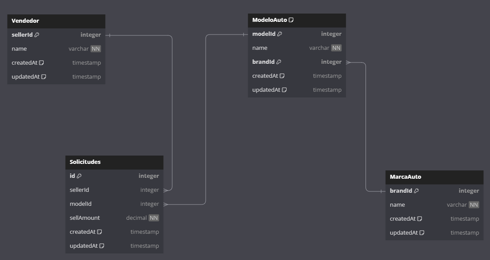

## Solicitud N°2:

# Pasos a seguir

1. dirigirse a la carpeta scripts, copiar o descargar el archivo scriptGeneral.sql y ejecutar dicho script en ambiente de preferencia

# Notas

- Se hizo previamente el diagrama de la base de datos en [dbdiagram.io](https://dbdiagram.io/home). Se encuentra dentro de la carpeta diagram para su visualización si se gusta
- Se hizo de manera individual scripts para cada paso del levantamiento de la base de datos, para mejor revisión
- puede que los store procedures tengan que crearse de a uno
